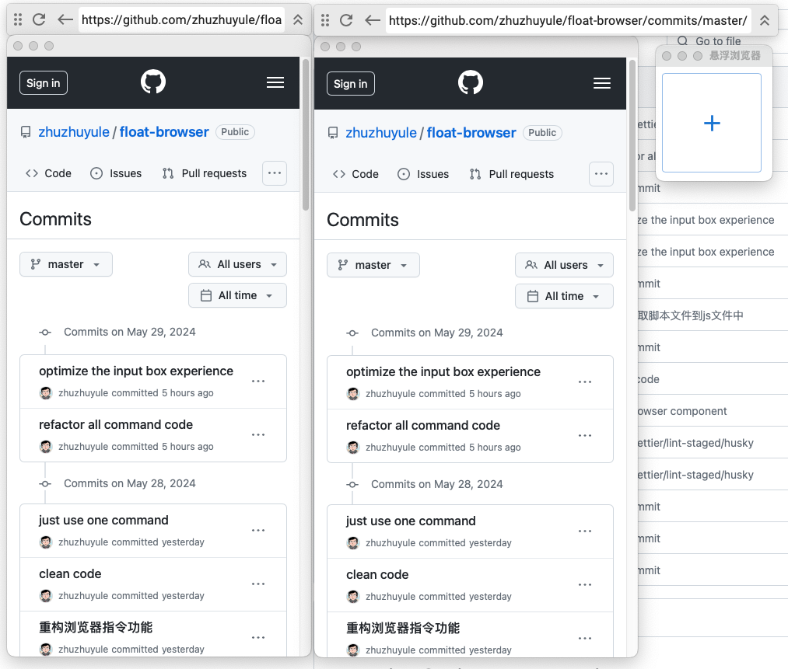

# Float Browser

## 简介

一款始终悬浮显示的浏览器，支持调试、折叠、缓存请求、其他悬浮小工具等一系列可悬浮的小工具。帮助前端开发人员提高开发效率。

## Screenshot



## Features

- [x] 悬浮浏览器
- [x] 自动显示全部URL
- [x] toggle折叠浏览器
- [x] 快捷键支持
- [x] 在线调试JS与各种框架
- [x] Debug
- [x] 缓存当前页面xhr请求
- [] 缓存fetch请求
- [] 修改缓存内容
- [] 自动更新

## 启动

```
git clone https://github.com/zhuzhuyule/float-browser.git
cd float-browser
pnpm i
pnpm tauri dev
```
